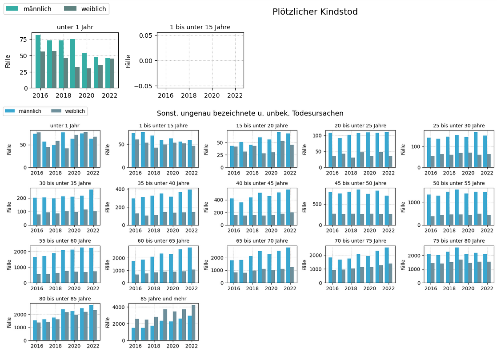
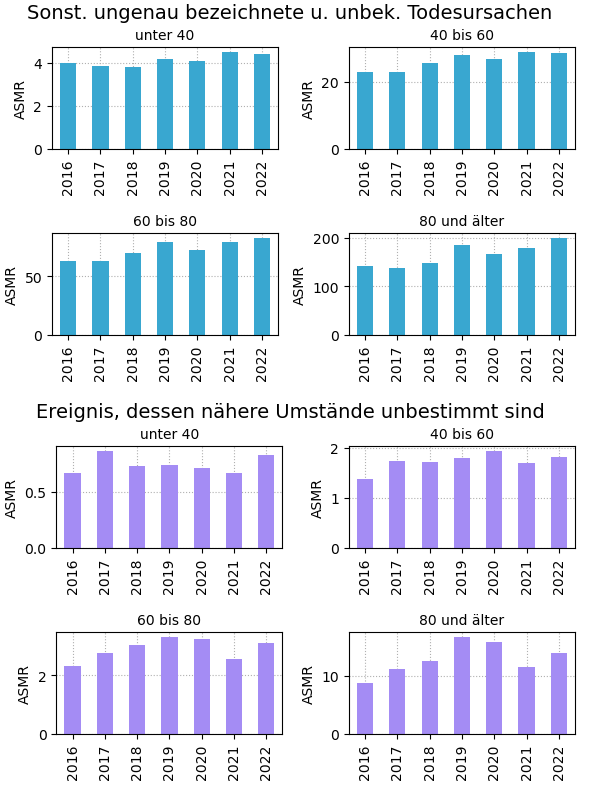

# Todesursachen Altersbezogene Statistik Deutschland

[todesursachen.ipynb (zum Betrachten anklicken)](./todesursachen.ipynb) ist ein Jupyter Notebook, das mittels Python die Sterbefalldaten des Statistischen Bundesamtes auswertet.
Dabei werden ausgewählte Todesursachen vergangener Jahre (2016-2022) in Diagrammen visualisiert.

Im Repository ist der Datensatz hinterlegt, der mittels [Konfigurator des Statistischen Bundesamts](https://www-genesis.destatis.de/genesis/online?sequenz=statistikTabellen&selectionname=23211) (23211-0004: _Gestorbene: Deutschland, Jahre, Todesursachen, Geschlecht, Altersgruppen_) erstellt wurde. Es gilt die entsprechende [Datenlizenz Deutschland – Namensnennung – Version 2.0](https://www.destatis.de/DE/Service/Impressum/copyright-genesis-online.html).

Ausgewählte Merkmale:

- Akuter oder rezidivierender Myokardinfarkt
- Grippe
- COVID-19, Virus nachgewiesen
- COVID-19, Virus nicht nachgewiesen
- Plötzlicher Kindstod
- Sonst. ungenau bezeichnete u. unbek. Todesursachen
- Ereignis, dessen nähere Umstände unbestimmt sind
- Insgesamt (alle Sterbefälle)

Auszug Absolutwerte:

Auszug altersspezifische Mortalitätsrate [1]:

Der Code darf frei verwendet und verändert werden (public domain, CC0).

[1] Altersspezifische Mortalitätsrate:

$$
\frac{\text{Absolute Sterbefälle einer Altersgruppe}}{\text{Populationsgröße dieser Altersgruppe}} \cdot 100\,000
$$
